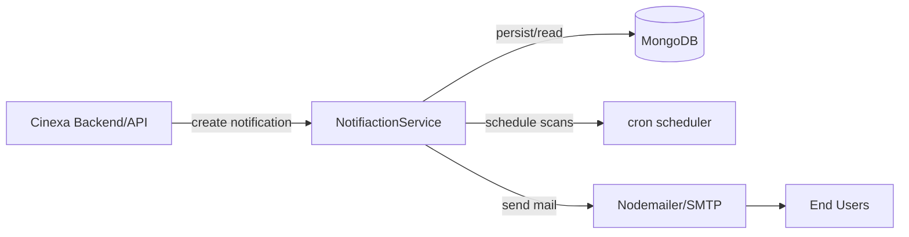
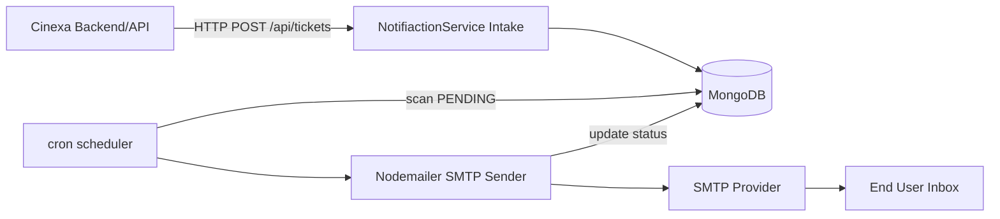
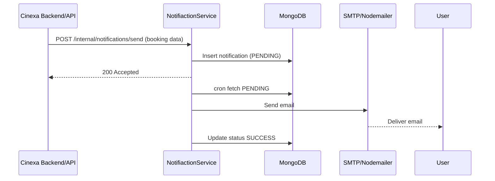
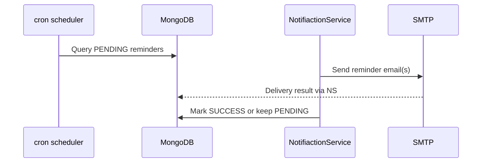
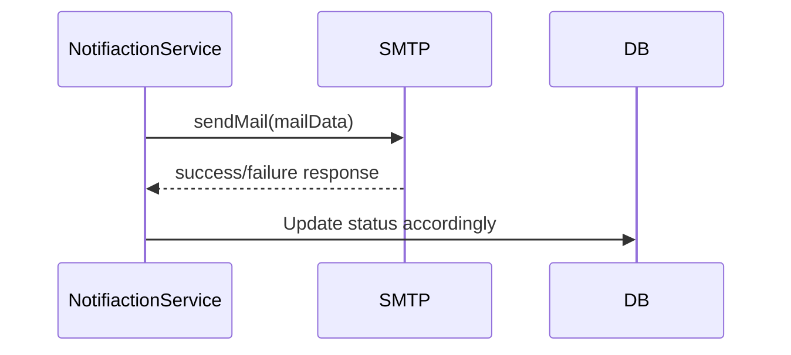
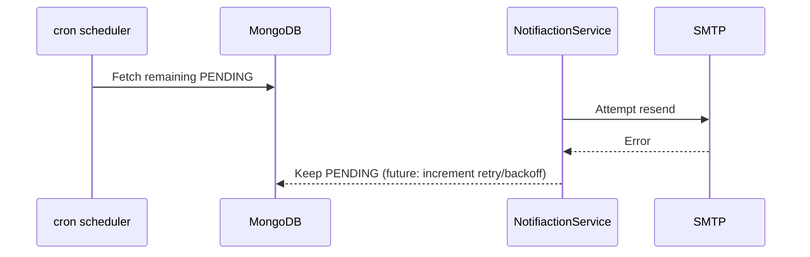
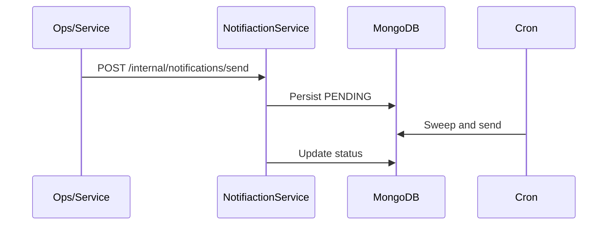

# NotifiactionService
> Cinexa notification service — send booking emails and reminders reliably.

NotifiactionService is the background notification system for Cinexa, handling queued email delivery, reminder scheduling, and retry processing. It receives notification jobs from the Cinexa backend/API, persists them in MongoDB, and delivers transactional emails to Cinexa users via Nodemailer. A cron scheduler continuously scans pending notifications, sends them, and updates status for downstream observability.

**Repositories**
- Core backend/API: https://github.com/jatin-sh01/CINEXA.git
- Frontend SPA: https://github.com/jatin-sh01/CINEXA-frontend.git
- Notification service: https://github.com/jatin-sh01/NotifiactionService.git

## Table of Contents
1. Overview  
2. High-Level Design (HLD)  
3. Low-Level Design (LLD)  
4. Quick Start  
5. Repository Layout  
6. Environment Variables  
7. Architecture  
8. Service Overview  
9. API / Event Flow Overview  
10. Scripts & Running  
11. Testing  
12. Project Structure  
13. Deployment  
14. Timeline  
15. Open Items  

## Overview
- Purpose: dedicated notification microservice for Cinexa movie ticket bookings; handles booking confirmations, reminders, and other transactional emails.
- Audience: Cinexa backend engineers, ops teams, and contributors maintaining notification delivery.
- Problem it solves: reliable, decoupled email delivery with scheduling and retries, keeping the core API fast and responsive.
- Cinexa integration: the main Cinexa backend/API creates notification records (e.g., after bookings) via internal endpoints; the Cinexa frontend renders results of those actions while emails are sent asynchronously.
- Scope: this repository covers the notification service only; the main Cinexa backend and frontend live in separate repositories.

## High-Level Design (HLD)
- Service goals: reliable, idempotent notification delivery; minimal coupling to core API; observable outcomes.
- Core responsibilities: intake notification jobs, persist them, schedule reminders, send emails, track status, and retry failures.
- Event intake model: backend posts notification jobs to an internal Express endpoint; records stored in MongoDB with `PENDING` status.
- Scheduling/reminder model: node-cron scans for `PENDING` notifications on a fixed cadence (currently every 2 minutes).
- Delivery model: Nodemailer SMTP transport (Gmail by default) sends emails using stored subject/body/html.
- Retry model: simple retry loop per cron sweep; failures are logged; future enhancement to add capped backoff and dead-lettering.
- Backend/API & MongoDB: Cinexa backend writes jobs; this service reads/writes MongoDB for notification state.
- Scalability & reliability: horizontal scaling requires idempotency and lock/dedup safeguards (see Open Items). MongoDB as single source of truth enables multi-instance reads; SMTP should be pooled.

**Mermaid – System Overview**


**Notification ingestion**
- Accepts jobs via internal API, validates payload, stores as `PENDING`.

**Scheduled jobs**
- Cron triggers periodic sweeps to find unsent notifications.

**Email delivery**
- Nodemailer SMTP transport sends emails; supports HTML (with fallback template).

**Retry and failure handling**
- Logs errors; can be retried on next cron sweep; future backoff/limits recommended.

**Data storage**
- MongoDB stores subject, content, optional HTML, recipients, status, timestamps.

**External integrations**
- MongoDB for persistence; SMTP (Gmail by default) for outbound mail; Cinexa backend as job producer.

## Low-Level Design (LLD)
- Module structure: Express app bootstrap in [index.js](index.js); routes in [routes/ticketRoutes.js](routes/ticketRoutes.js); controller in [controller/ticketController.js](controller/ticketController.js); validation middleware in [middleware/ticket.middlewares.js](middleware/ticket.middlewares.js); cron scheduler in [cron/cron.js](cron/cron.js); mailer factory in [services/emailService.js](services/emailService.js); Mongoose model in [models/ticketNotification.js](models/ticketNotification.js).
- Route handlers: `/api/tickets` for create/list/get; creation validates subject/content/recipient emails.
- Service layer: mailer factory wraps Nodemailer Gmail transport.
- Notification model/schema: stores `subject`, `content`, optional `html`, `recepientEmails`, `status` (`SUCCESS|PENDING|FAILED`), timestamps.
- Cron job execution: every 2 minutes fetches `PENDING` notifications, sends emails, updates status to `SUCCESS` on send.
- Email payload generation: uses stored `html` if provided; otherwise builds a branded fallback HTML template with optional inline logo attachment and configurable colors/branding.
- Retry logic: on send error, status remains `PENDING`; next cron sweep will retry (implicit retry). Backoff and cap are TODO.
- Failure states: SMTP errors, invalid addresses, missing templates; currently logged only.
- Logging: console logs for cron execution, mail attempts, and outcomes.
- Idempotency/duplicate prevention: not yet implemented; recommended to add per-notification send locks and dedup keys.
- Pending fetch/mark processed: cron queries MongoDB for `PENDING`, sends, then marks each as `SUCCESS`; failures are left pending for retry.

**Mermaid – Internal Processing Flow**
```mermaid
flowchart TD
  A[Receive notification request] --> B[Validate payload]
  B --> C[Persist as PENDING in MongoDB]
  D[cron schedule tick] --> E[Fetch PENDING notifications]
  E --> F[Build mail payload (HTML or fallback)]
  F --> G[Send via Nodemailer SMTP]
  G -->|success| H[Update status to SUCCESS]
  G -->|failure| I[Log error and keep PENDING for retry]
```

**Key entities**
- Notification: subject, content/plaintext, optional HTML, recipients, status, timestamps.
- Recipient: list of email addresses per notification.
- Template: optional prebuilt HTML; fallback template auto-generated when missing.
- Retry metadata: currently implicit (PENDING status); future explicit counters/backoff recommended.
- Delivery status: `PENDING` → `SUCCESS`; `FAILED` reserved for explicit failure marking.
- Scheduled reminder job: cron sweep acting as reminder/delivery trigger.

## Quick Start
Prerequisites: Node.js 18+, MongoDB instance, SMTP credentials (Gmail or other), npm.

```bash
# Clone
git clone <repo-url> notifiactionservice
cd notifiactionservice

# Install
npm install

# Configure environment
cp .env.example .env  # if present; otherwise create .env (see variables below)

# Run locally (dotenv loads env)
npm run dev           # nodemon
# or
npm start             # node
```

## Repository Layout
- Express app/bootstrap: [index.js](index.js)
- Routes/controllers: [routes/ticketRoutes.js](routes/ticketRoutes.js), [controller/ticketController.js](controller/ticketController.js)
- Validation middleware: [middleware/ticket.middlewares.js](middleware/ticket.middlewares.js)
- Data model: [models/ticketNotification.js](models/ticketNotification.js)
- Cron scheduler: [cron/cron.js](cron/cron.js)
- Mailer service: [services/emailService.js](services/emailService.js)
- Utilities: [utils/constants.js](utils/constants.js) (placeholder)
- Integrates with Cinexa by exposing internal notification endpoints and consuming MongoDB/SMTP.

## Environment Variables
| Name | Required | Description |
| --- | --- | --- |
| PORT | Optional (default 3000) | HTTP port for Express server |
| NODE_ENV | Optional | Runtime environment flag |
| DB_URI | Required | MongoDB connection string |
| EMAIL | Required | SMTP user (Gmail by default) |
| EMAIL_PASS | Required | SMTP password/app password |
| CRON_SCHEDULE | TODO | Cron expression override (currently hardcoded `*/2 * * * *`) |
| RETRY_LIMIT | TODO | Max retries before marking failed |
| RETRY_BACKOFF_MS | TODO | Backoff delay between retries |
| API_SECRET | TODO | Internal auth/verification for intake endpoints |
| MAIL_BRAND_NAME | Optional | Brand name for fallback template |
| MAIL_PRIMARY_COLOR | Optional | Primary color for fallback template |
| MAIL_BG_COLOR | Optional | Background color for fallback template |
| MAIL_LOGO_URL | Optional | Logo URL for email template |
| MAIL_LOGO_CID | Optional | CID reference for inline logo |
| MAIL_LOGO_PATH | Optional | Filesystem path for inline logo attachment |

## Architecture
- Job consumption: Express endpoint persists notification jobs as `PENDING`.
- Scheduling: node-cron ticks every 2 minutes (or configured) to scan MongoDB for pending jobs.
- Delivery: Nodemailer Gmail SMTP sends email; uses stored HTML or generated fallback template.
- Status updates: after successful send, MongoDB record updated to `SUCCESS`; failures remain `PENDING` for retry.
- Retry handling: implicit retry on subsequent cron runs; future explicit retry counters/backoff recommended.
- Data flow: Cinexa backend → HTTP intake → MongoDB (PENDING) → cron → Nodemailer → user inbox → MongoDB (SUCCESS/FAILED).

**Mermaid – Notification Service Architecture**


**Mermaid – Job Processing Flow**
```mermaid
flowchart TD
  Tick[cron tick] --> Fetch[Fetch PENDING notifications]
  Fetch --> Loop{for each notification}
  Loop --> Build[Build mail payload (HTML or fallback)]
  Build --> Send[Send via Nodemailer]
  Send -->|ok| Mark[Mark SUCCESS in MongoDB]
  Send -->|error| Keep[Leave PENDING for retry; log error]
```

## Service Overview

### Notification Intake / Event Consumption
- Notifications arrive via internal Express route `/api/tickets` (POST).
- Payload validated for subject, content, and recipient emails.
- Stored in MongoDB as `PENDING` for later delivery; duplicates currently not deduped.

### Scheduled Reminder Jobs
- node-cron runs every 2 minutes to sweep for `PENDING` notifications.
- Selected notifications are attempted for send; future improvement to segment reminders vs. immediate sends.

### Nodemailer Delivery
- Gmail SMTP transport configured via `EMAIL` and `EMAIL_PASS`.
- Uses provided `html` body or fallback templating with branding/colors/logo.
- Supports inline logo attachment when `MAIL_LOGO_PATH` is set.

### Retry and Failure Handling
- On send error, notification remains `PENDING`; retried on next cron tick.
- No explicit backoff or max retry yet; recommended additions: retry counters, exponential backoff, and dead-letter queue.

### Persistence and Logging
- MongoDB tracks status and timestamps for auditability.
- Console logging for cron execution, send attempts, successes, and errors; structured logging recommended for production.

## API / Event Flow Overview

### Booking Confirmation Notification Flow


### Scheduled Reminder Flow


### Email Delivery Flow


### Retry / Failure Flow


### Manual/Internal Trigger Flow


## Scripts & Running
| Script | Purpose |
| --- | --- |
| npm install | Install dependencies |
| npm run dev | Start with nodemon (hot reload) |
| npm start | Start with node |
| npm test | Currently placeholder (echo only) |

## Testing
- Current status: no automated tests.
- Recommended: Jest for unit tests, Supertest for route testing, mocked Nodemailer transports for delivery logic, cron job unit tests, and integration tests covering notification persistence, send, and retry paths.

## Project Structure
```bash
.
├─ index.js
├─ controller/
│  └─ ticketController.js
├─ routes/
│  └─ ticketRoutes.js
├─ middleware/
│  └─ ticket.middlewares.js
├─ models/
│  └─ ticketNotification.js
├─ services/
│  └─ emailService.js
├─ cron/
│  └─ cron.js
├─ utils/
│  └─ constants.js
├─ package.json
└─ .env (local, not committed)
```

## Deployment
- Environment: Node.js runtime (container or VM), access to MongoDB and SMTP.
- Build/start: `npm install` then `npm start`; ensure `DB_URI`, `EMAIL`, `EMAIL_PASS`, and port are set.
- Background execution: run as a service (PM2/systemd) or container; cron-based scheduler runs in-process.
- SMTP: provide production SMTP credentials; consider provider-level rate limits and pools.
- MongoDB: ensure network access, credentials, and TLS as required.
- Logging/monitoring: ship logs to centralized system; add health/readiness endpoints for orchestration.
- Scaling: if horizontally scaled, add idempotency, per-job locks, and retry caps to avoid duplicate sends.
- CI/CD & Docker: not present; recommended to add for repeatable builds and deployments.

## Timeline
- Phase 1: notification model and email delivery
- Phase 2: cron scheduling for pending sends/reminders
- Phase 3: retry handling with backoff and limits
- Phase 4: logging, metrics, and reliability hardening
- Phase 5: deployment, monitoring, and CI/CD

## Open Items
- Add `.env.example` with required vars
- Improve test coverage (unit, integration, cron, mailer mocks)
- Add template management and per-notification branding
- Implement retry/backoff limits and dead-letter handling
- Add alerting/monitoring and structured logging
- Add CI/CD pipeline and Docker support
- Add health/readiness endpoints
- Add idempotency safeguards and duplicate suppression
